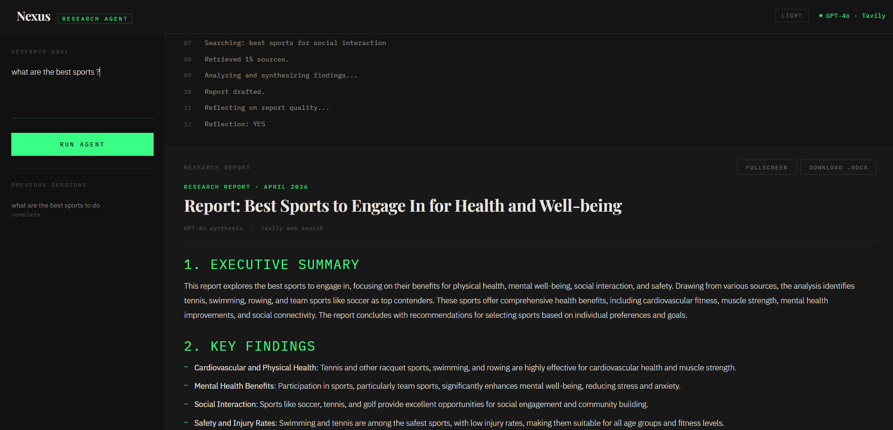
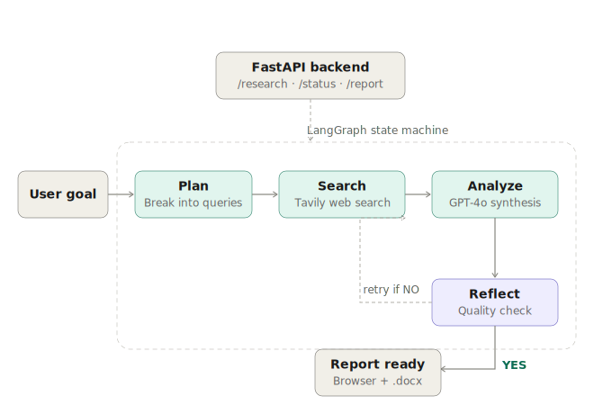

# Nexus Agent

Autonomous AI research agent that searches the web, analyzes findings, and delivers structured reports in real time.

**Live Demo:** https://nexus-agent-26y9.onrender.com

---

## Demo

---

## How it works

Give Nexus a research goal and it autonomously:

1. Plans 3–5 targeted search queries from your goal
2. Searches the web across multiple sources using Tavily
3. Synthesizes findings into a structured report using GPT-4o
4. Reflects on report quality and loops back if needed
5. Delivers the report — readable in browser or downloadable as Word

All steps are visible in real time through the live thinking feed.

---

## Architecture

The agent is built as a LangGraph state machine with four nodes. After drafting a report, the Reflect node checks whether the goal is fully addressed. If not, it loops back to Search for another pass. Maximum two iterations.

---

## Features

- Live agent thinking feed — watch every step as it happens
- Structured reports: Executive Summary, Key Findings, Detailed Analysis, Sources
- Download report as Word document (.docx)
- Fullscreen report mode
- Light and dark mode
- Enter key to submit

---

## Tech Stack

| Layer | Technology |
|---|---|
| Agent | LangGraph + GPT-4o |
| Web Search | Tavily API |
| Backend | FastAPI + Python |
| Frontend | HTML / CSS / JS |
| Deployment | Render |

---

## How to Run Locally

\`\`\`bash
git clone https://github.com/tarekjundi10/nexus-agent.git
cd nexus-agent
pip install -r requirements.txt
\`\`\`

Create a \`.env\` file:

\`\`\`
OPENAI_API_KEY=your-openai-key
TAVILY_API_KEY=your-tavily-key
\`\`\`

Run:

\`\`\`bash
uvicorn app.main:app --reload
\`\`\`

Open http://127.0.0.1:8000

---

## API Endpoints

| Method | Endpoint | Description |
|---|---|---|
| POST | \`/research\` | Start a research session |
| GET | \`/status/{id}\` | Get live agent steps |
| GET | \`/report/{id}\` | Get the final report |
| GET | \`/download/{id}\` | Download report as .docx |
